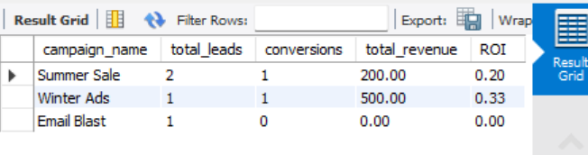

# 📊 Marketing Campaign Performance Analysis (SQL Project)

##  Objective

The goal of this project is to analyze marketing campaign performance using SQL.
It focuses on evaluating:

* Total leads generated by each campaign
* Conversion performance
* Revenue generated
* ROI (Return on Investment)

---

##  Database Structure

The project is built using four relational tables:

* **campaigns** → Stores campaign details (name, channel, budget)
* **customers** → Stores customer information
* **leads** → Tracks interactions between customers and campaigns
* **sales** → Records revenue generated from converted leads

---

##  Key SQL Concepts Used

* **JOIN** → Combine multiple tables
* **LEFT JOIN** → Include all leads even if no sales exist
* **GROUP BY** → Aggregate data by campaign
* **COUNT()** → Total leads
* **SUM()** → Revenue and conversions
* **CASE WHEN** → Conditional counting (conversions)
* **COALESCE()** → Handle NULL values
* **ROUND()** → Format numerical output

---

##  Key Analysis

### 1. Total Leads per Campaign

Used `GROUP BY` and `COUNT()` to measure campaign reach.

### 2. Conversion Tracking

Used `CASE WHEN` inside `SUM()` to count only converted leads.

### 3. Revenue Analysis

Used `LEFT JOIN` with the sales table to calculate total revenue per campaign.

### 4. ROI Calculation

ROI is calculated as:

ROI = Total Revenue / Campaign Budget

---

## 💡 Key Insights

* **Winter Ads (Google)** achieved the highest ROI and conversion rate
* **Summer Sale (Facebook)** generated more leads but lower efficiency
* **Email Campaign** had no conversions and generated no revenue

---

##  Tools Used

* MySQL Workbench
* SQL (Joins, Aggregations, Conditional Logic)

---

## 📸  Output

---

##  Conclusion

This project demonstrates how SQL can be used to transform raw marketing data into actionable business insights, helping companies make data-driven decisions.

---
